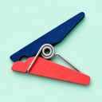
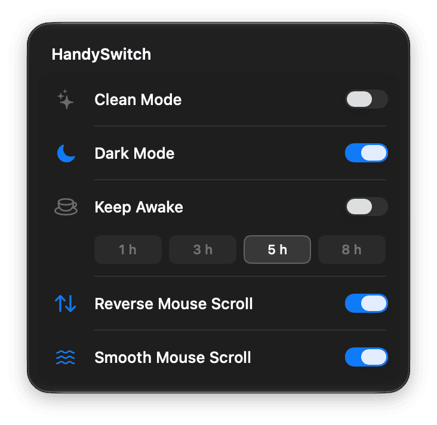

**Languages:** English | [简体中文](README.zh-CN.md)

# HandySwitch

<p align="center">
  
</p>

**Toggle macOS dark mode and prevent sleep from the menu bar** without opening System Settings. Left-click for Clean Mode, Dark Mode, Prevent Sleep, Reverse Mouse Scroll, and Smooth Mouse Scroll.

It is not OnlySwitch or Mos. There is no feature supermarket, no per-app scroll profiles, and no Dock icon. The switches live under the menu bar icon.

**Requires macOS 26 or later.** Open source under the MIT License. Everything stays on your Mac — no account, no telemetry.

<p align="center">
  
</p>

## Supported platforms

- **macOS 26+** (Apple silicon and Intel)
- **Not Windows or Linux.** This app depends on the macOS menu bar, Accessibility, Automation (System Events for Dark Mode), and local input/scroll APIs.

## Install

### Homebrew (recommended)

```sh
brew tap x0c/tap
brew install --cask handy-switch
```

### Direct download

Grab the latest **signed and notarized** `HandySwitch-x.y.z.dmg` from the [releases](https://github.com/x0c/HandySwitch/releases/latest) page, then drag HandySwitch to `/Applications`.

HandySwitch checks for updates automatically (via [Sparkle](https://sparkle-project.org)). Use **Check for Updates…** from the menu bar right-click menu or the main window.

### Build from source

Requires Xcode 26+ and [XcodeGen](https://github.com/yonaskolb/XcodeGen):

```sh
git clone https://github.com/x0c/HandySwitch.git
cd HandySwitch
xcodegen generate
xcodebuild -project HandySwitch.xcodeproj -scheme HandySwitch -configuration Release \
  -destination 'platform=macOS' -derivedDataPath build/DerivedData build
rm -rf /Applications/HandySwitch.app
ditto build/DerivedData/Build/Products/Release/HandySwitch.app /Applications/HandySwitch.app
open /Applications/HandySwitch.app
```

## Usage

1. Click the menu bar icon to open the switch panel under the icon. Click outside to close.
2. Right-click for **Open Main Window**, **Launch at Login**, **Check for Updates…**, or **Quit**. The main window mirrors launch-at-login, check-for-updates, and quit (so those stay reachable if you only open the window).
3. **Clean Mode** and scroll toggles need **Accessibility**. **Dark Mode** needs **Automation** (System Events). If a switch cannot turn on, follow the in-app link to System Settings.
4. In Clean Mode, hold **Esc** for about three seconds to exit (the only exit gesture).
5. Launch at login is off by default. Login launches stay silent (no window).

## Features

- Five polished toggles only — nothing half-finished in the panel
- Clean Mode: full-screen black covers that block input while you wipe the screen or keyboard
- Dark Mode mirrors system appearance (not Night Shift)
- Prevent Sleep with preset durations
- Reverse / smooth mouse scroll without per-app profiles
- Menu bar template icon; no Dock icon

## Not in scope

OnlySwitch-style feature markets, Mos-style per-app scroll / button remapping / inertia physics, hiding desktop icons as “clean mode”, Mac App Store, sandboxing, or Windows/Linux clients.

## License

[MIT](LICENSE)
